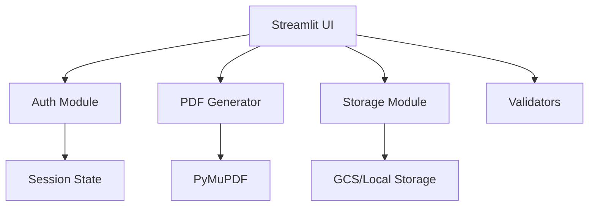

# Certificate Generator - API Documentation

## Table of Contents
1. [Architecture Overview](#architecture-overview)
2. [Core Modules](#core-modules)
3. [API Reference](#api-reference)
4. [Usage Examples](#usage-examples)
5. [Error Handling](#error-handling)
6. [Performance Considerations](#performance-considerations)
7. [Extension Points](#extension-points)

## Architecture Overview

The Certificate Generator is built using a modular architecture with clear separation of concerns:

```
certificate-generator/
├── app.py                 # Main Streamlit application
├── pages/                 # Streamlit pages
│   ├── 1_login.py        # Authentication page
│   ├── 2_generate.py     # Certificate generation UI
│   └── 3_admin.py        # Admin panel
├── utils/                 # Core functionality
│   ├── auth.py           # Authentication logic
│   ├── pdf_generator.py  # PDF generation engine
│   ├── validators.py     # Input validation
│   └── storage.py        # Storage abstraction
└── config.py             # Application configuration
```

### Component Interactions


## Core Modules

### 1. Authentication Module (`utils/auth.py`)

Handles user authentication and password management.

```python
def verify_password(username: str, password: str) -> bool:
    """
    Verify user credentials against stored passwords.
    
    Args:
        username: Either 'user' or 'admin'
        password: Password to verify
        
    Returns:
        bool: True if credentials are valid
        
    Example:
        >>> verify_password('user', 'UserPass123')
        True
    """

def hash_password(password: str) -> str:
    """
    Hash a password using SHA-256.
    
    Args:
        password: Plain text password
        
    Returns:
        str: Hexadecimal hash of the password
        
    Example:
        >>> hash_password('MySecurePass')
        'a665a45920422f9d417e4867efdc4fb8a04a1f3fff1fa07e998e86f7f7a27ae3'
    """

def update_password(user_type: str, new_password: str) -> bool:
    """
    Update password for a user type.
    
    Args:
        user_type: Either 'user' or 'admin'
        new_password: New password to set
        
    Returns:
        bool: True if update successful
        
    Raises:
        ValueError: If user_type is invalid
        PermissionError: If storage is not writable
    """

def check_session(session_state) -> bool:
    """
    Verify if current session is authenticated.
    
    Args:
        session_state: Streamlit session state object
        
    Returns:
        bool: True if session is valid and not expired
    """
```

### 2. PDF Generator Module (`utils/pdf_generator.py`)

Core certificate generation functionality using PyMuPDF.

```python
class CertificateField:
    """Represents a form field in the PDF template."""
    name: str              # Field name (e.g., 'FirstName')
    rect: fitz.Rect       # Bounding box coordinates
    page_num: int         # Page number (0-indexed)
    max_font_size: float  # Maximum font size (default: 24.0)
    min_font_size: float  # Minimum font size (default: 14.0)

class GenerationResult:
    """Result of certificate generation."""
    success: bool          # Whether generation succeeded
    filename: str         # Output filename
    error: Optional[str]  # Error message if failed
    processing_time: float # Time taken in seconds

class PDFGenerator:
    """Handles PDF certificate generation with form fields."""
    
    def __init__(self, template_path: str):
        """
        Initialize generator with a PDF template.
        
        Args:
            template_path: Path to PDF template file
            
        Raises:
            ValueError: If template is invalid or missing required fields
            FileNotFoundError: If template file doesn't exist
        """
    
    def generate_certificate(self, 
                           first_name: str, 
                           last_name: str, 
                           output_path: Optional[str] = None) -> str:
        """
        Generate a single certificate.
        
        Args:
            first_name: Recipient's first name
            last_name: Recipient's last name
            output_path: Optional output file path
            
        Returns:
            str: Path to generated certificate
            
        Raises:
            RuntimeError: If PDF generation fails
            
        Example:
            >>> gen = PDFGenerator('templates/basic.pdf')
            >>> path = gen.generate_certificate('John', 'Doe')
            >>> print(f"Certificate saved to: {path}")
        """
    
    def generate_preview(self, 
                        first_name: str = "John", 
                        last_name: str = "Doe") -> bytes:
        """
        Generate a preview certificate in memory.
        
        Args:
            first_name: Sample first name for preview
            last_name: Sample last name for preview
            
        Returns:
            bytes: PDF content as bytes
            
        Example:
            >>> preview_bytes = gen.generate_preview()
            >>> st.download_button("Download Preview", preview_bytes)
        """
    
    def generate_batch(self, 
                      recipients: List[Dict[str, str]], 
                      output_dir: str = None,
                      progress_callback = None) -> Tuple[List[GenerationResult], str]:
        """
        Generate certificates for multiple recipients.
        
        Args:
            recipients: List of dicts with 'first_name' and 'last_name'
            output_dir: Directory for output files (temp if None)
            progress_callback: Function(current, total, message)
            
        Returns:
            Tuple of (results list, zip file path)
            
        Example:
            >>> recipients = [
            ...     {'first_name': 'John', 'last_name': 'Doe'},
            ...     {'first_name': 'Jane', 'last_name': 'Smith'}
            ... ]
            >>> results, zip_path = gen.generate_batch(recipients)
        """
    
    def validate_template(self) -> Dict[str, any]:
        """
        Validate template and return information.
        
        Returns:
            Dict with keys:
                - valid: bool
                - fields_found: List[str]
                - missing_fields: List[str]
                - page_count: int
                - file_size: int
                - errors: List[str]
        """
```

### 3. Validators Module (`utils/validators.py`)

Input validation and data processing functions.

```python
def validate_spreadsheet(df: pd.DataFrame) -> Tuple[bool, List[str], pd.DataFrame]:
    """
    Validate uploaded spreadsheet data.
    
    Args:
        df: Pandas DataFrame from uploaded file
        
    Returns:
        Tuple of:
            - is_valid: bool
            - errors: List of error messages
            - cleaned_df: Processed DataFrame
            
    Example:
        >>> df = pd.read_csv('recipients.csv')
        >>> valid, errors, clean_df = validate_spreadsheet(df)
        >>> if valid:
        ...     process_data(clean_df)
        ... else:
        ...     show_errors(errors)
    """

def clean_name(name: str) -> str:
    """
    Clean and normalize a name string.
    
    Args:
        name: Raw name string
        
    Returns:
        str: Cleaned name
        
    Example:
        >>> clean_name('  JOHN  ')
        'John'
        >>> clean_name('mary-jane')
        'Mary-Jane'
    """

def validate_file_type(file) -> Tuple[bool, str]:
    """
    Check if uploaded file is valid type.
    
    Args:
        file: Streamlit UploadedFile object
        
    Returns:
        Tuple of (is_valid, error_message)
    """

def prepare_recipient_data(df: pd.DataFrame) -> List[Dict[str, str]]:
    """
    Convert DataFrame to list of recipient dictionaries.
    
    Args:
        df: Validated DataFrame
        
    Returns:
        List of dicts with 'first_name' and 'last_name' keys
    """
```

### 4. Storage Module (`utils/storage.py`)

Abstraction layer for Google Cloud Storage and local file storage.

```python
class StorageManager:
    """Manages file storage with GCS and local fallback."""
    
    def __init__(self, bucket_name: str = None, use_local: bool = False):
        """
        Initialize storage manager.
        
        Args:
            bucket_name: GCS bucket name
            use_local: Force local storage mode
        """
    
    def upload_template(self, file_path: str, template_name: str) -> bool:
        """
        Upload a template file to storage.
        
        Args:
            file_path: Local path to template file
            template_name: Name for the template
            
        Returns:
            bool: Success status
            
        Example:
            >>> storage = StorageManager('my-bucket')
            >>> storage.upload_template('template.pdf', 'Basic Certificate')
        """
    
    def download_template(self, template_name: str) -> str:
        """
        Download template to local cache.
        
        Args:
            template_name: Name of template to download
            
        Returns:
            str: Local path to downloaded file
            
        Raises:
            FileNotFoundError: If template doesn't exist
        """
    
    def list_templates(self) -> List[Dict[str, any]]:
        """
        List all available templates.
        
        Returns:
            List of dicts with keys:
                - name: Template name
                - size: File size in bytes
                - modified: Last modified datetime
                - path: Storage path
        """
    
    def delete_template(self, template_name: str) -> bool:
        """
        Delete a template from storage.
        
        Args:
            template_name: Name of template to delete
            
        Returns:
            bool: Success status
        """
    
    def save_activity_log(self, activity: Dict[str, any]) -> bool:
        """
        Log user activity for analytics.
        
        Args:
            activity: Dict with activity details
            
        Returns:
            bool: Success status
        """
    
    def get_usage_stats(self) -> Dict[str, any]:
        """
        Retrieve usage statistics.
        
        Returns:
            Dict with usage metrics
        """
    
    def cleanup_old_files(self, age_hours: int = 2) -> int:
        """
        Remove temporary files older than specified age.
        
        Args:
            age_hours: Age threshold in hours
            
        Returns:
            int: Number of files deleted
        """
```

### 5. Configuration Module (`config.py`)

Application configuration and settings.

```python
class Config:
    """Application configuration settings."""
    
    # Authentication
    USER_PASSWORD: str = os.getenv('USER_PASSWORD', 'UserPass123')
    ADMIN_PASSWORD: str = os.getenv('ADMIN_PASSWORD', 'AdminPass456')
    SESSION_TIMEOUT: int = int(os.getenv('SESSION_TIMEOUT', '1800'))
    
    # Storage
    GCS_BUCKET: str = os.getenv('GCS_BUCKET', '')
    USE_LOCAL_STORAGE: bool = os.getenv('USE_LOCAL_STORAGE', 'false').lower() == 'true'
    
    # Limits
    MAX_UPLOAD_SIZE: int = int(os.getenv('MAX_UPLOAD_SIZE', '5242880'))  # 5MB
    MAX_ROWS: int = int(os.getenv('MAX_ROWS', '500'))
    RATE_LIMIT: int = int(os.getenv('RATE_LIMIT', '40'))
    
    # Paths
    TEMPLATE_DIR: str = 'templates'
    TEMP_DIR: str = 'temp'
    LOCAL_STORAGE_DIR: str = 'local_storage'
    
    # Performance
    WORKERS: int = int(os.getenv('WORKERS', '4'))
    CHUNK_SIZE: int = 50  # Batch processing chunk size
    
    @classmethod
    def validate(cls) -> bool:
        """Validate configuration settings."""
        if not cls.USER_PASSWORD or not cls.ADMIN_PASSWORD:
            raise ValueError("Passwords must be set")
        return True
```

## Usage Examples

### Basic Certificate Generation
```python
from utils.pdf_generator import PDFGenerator

# Initialize generator
generator = PDFGenerator('templates/basic_certificate.pdf')

# Generate single certificate
output_path = generator.generate_certificate('John', 'Doe')
print(f"Certificate created: {output_path}")

# Generate preview
preview_bytes = generator.generate_preview()
with open('preview.pdf', 'wb') as f:
    f.write(preview_bytes)
```

### Batch Processing with Progress
```python
import pandas as pd
from utils.pdf_generator import PDFGenerator
from utils.validators import validate_spreadsheet, prepare_recipient_data

# Load and validate data
df = pd.read_csv('recipients.csv')
is_valid, errors, clean_df = validate_spreadsheet(df)

if not is_valid:
    print(f"Validation errors: {errors}")
    exit(1)

# Prepare recipient data
recipients = prepare_recipient_data(clean_df)

# Generate with progress tracking
def progress_callback(current, total, message):
    print(f"Progress: {current}/{total} - {message}")

generator = PDFGenerator('templates/professional_certificate.pdf')
results, zip_path = generator.generate_batch(
    recipients, 
    progress_callback=progress_callback
)

# Check results
successful = sum(1 for r in results if r.success)
print(f"Generated {successful}/{len(results)} certificates")
print(f"ZIP file: {zip_path}")
```

### Storage Operations
```python
from utils.storage import StorageManager

# Initialize storage
storage = StorageManager(bucket_name='cert-templates')

# Upload template
success = storage.upload_template(
    'new_template.pdf', 
    'Workshop Certificate 2025'
)

# List all templates
templates = storage.list_templates()
for template in templates:
    print(f"{template['name']} - {template['size']} bytes")

# Download for use
local_path = storage.download_template('Workshop Certificate 2025')
generator = PDFGenerator(local_path)
```

### Custom Integration
```python
import streamlit as st
from utils.auth import verify_password, check_session
from utils.pdf_generator import PDFGenerator
from utils.storage import StorageManager

# Authentication flow
if 'authenticated' not in st.session_state:
    username = st.text_input("Username")
    password = st.text_input("Password", type="password")
    
    if st.button("Login"):
        if verify_password(username, password):
            st.session_state.authenticated = True
            st.session_state.user_type = username
            st.success("Login successful!")
        else:
            st.error("Invalid credentials")

# Certificate generation flow
if check_session(st.session_state):
    uploaded_file = st.file_uploader("Upload Recipients", type=['csv', 'xlsx'])
    
    if uploaded_file:
        # Process file
        df = pd.read_csv(uploaded_file)
        is_valid, errors, clean_df = validate_spreadsheet(df)
        
        if is_valid:
            if st.button("Generate Certificates"):
                # Generate certificates
                generator = PDFGenerator(template_path)
                results, zip_path = generator.generate_batch(recipients)
                
                # Offer download
                with open(zip_path, 'rb') as f:
                    st.download_button(
                        "Download Certificates",
                        f.read(),
                        file_name="certificates.zip",
                        mime="application/zip"
                    )
```

## Error Handling

### Exception Hierarchy
```python
CertificateError(Exception)
├── TemplateError(CertificateError)
│   ├── MissingFieldError
│   └── InvalidPDFError
├── ValidationError(CertificateError)
│   ├── MissingColumnsError
│   └── InvalidDataError
└── StorageError(CertificateError)
    ├── UploadError
    └── DownloadError
```

### Error Handling Patterns
```python
from utils.pdf_generator import PDFGenerator, TemplateError

try:
    generator = PDFGenerator('template.pdf')
except FileNotFoundError:
    st.error("Template file not found")
except TemplateError as e:
    st.error(f"Template error: {e}")
except Exception as e:
    st.error(f"Unexpected error: {e}")
    logging.exception("PDF generation failed")
```

### Validation Error Messages
```python
VALIDATION_ERRORS = {
    'missing_columns': "Required columns 'first_name' and 'last_name' not found",
    'empty_file': "The uploaded file contains no data",
    'too_many_rows': f"File exceeds maximum of {Config.MAX_ROWS} rows",
    'invalid_names': "Some names contain invalid characters",
    'duplicate_entries': "Duplicate entries found in rows: {rows}"
}
```

## Performance Considerations

### Optimization Strategies

1. **Batch Processing**
   - Process certificates in chunks of 50
   - Use multiprocessing for large batches
   - Implement progress callbacks

2. **Caching**
   - Cache downloaded templates for 5 minutes
   - Cache validation results
   - Use Streamlit's native caching

3. **Memory Management**
   - Stream large files instead of loading entirely
   - Clean up temporary files immediately
   - Limit concurrent generations

### Performance Metrics
```python
# Typical performance benchmarks
PERFORMANCE_TARGETS = {
    'single_certificate': 0.5,      # seconds
    'batch_100': 50,               # seconds
    'batch_500': 250,              # seconds
    'template_download': 2,         # seconds
    'validation_1000_rows': 1,      # seconds
}
```

### Scaling Considerations
```python
# Resource limits
RESOURCE_LIMITS = {
    'max_concurrent_users': 10,
    'max_batch_size': 500,
    'max_file_size_mb': 5,
    'max_template_size_mb': 10,
    'rate_limit_per_minute': 40,
}
```

## Extension Points

### Adding New Template Types
```python
class CustomPDFGenerator(PDFGenerator):
    """Extended generator with custom features."""
    
    def add_qr_code(self, certificate_path: str, data: str):
        """Add QR code to existing certificate."""
        pass
    
    def add_signature_image(self, certificate_path: str, signature_path: str):
        """Add signature image to certificate."""
        pass
```

### Custom Storage Backends
```python
from abc import ABC, abstractmethod

class StorageBackend(ABC):
    """Abstract base for storage backends."""
    
    @abstractmethod
    def upload(self, local_path: str, remote_path: str) -> bool:
        pass
    
    @abstractmethod
    def download(self, remote_path: str, local_path: str) -> bool:
        pass

class S3Storage(StorageBackend):
    """AWS S3 storage implementation."""
    pass

class AzureStorage(StorageBackend):
    """Azure Blob storage implementation."""
    pass
```

### Plugin System
```python
class CertificatePlugin:
    """Base class for certificate plugins."""
    
    def pre_generate(self, data: Dict[str, any]) -> Dict[str, any]:
        """Called before certificate generation."""
        return data
    
    def post_generate(self, certificate_path: str, data: Dict[str, any]):
        """Called after certificate generation."""
        pass

# Example plugin
class WatermarkPlugin(CertificatePlugin):
    def post_generate(self, certificate_path: str, data: Dict[str, any]):
        # Add watermark to certificate
        pass
```

---

**Note**: This documentation reflects the current implementation. For the latest updates and additional features, refer to the source code and inline documentation.